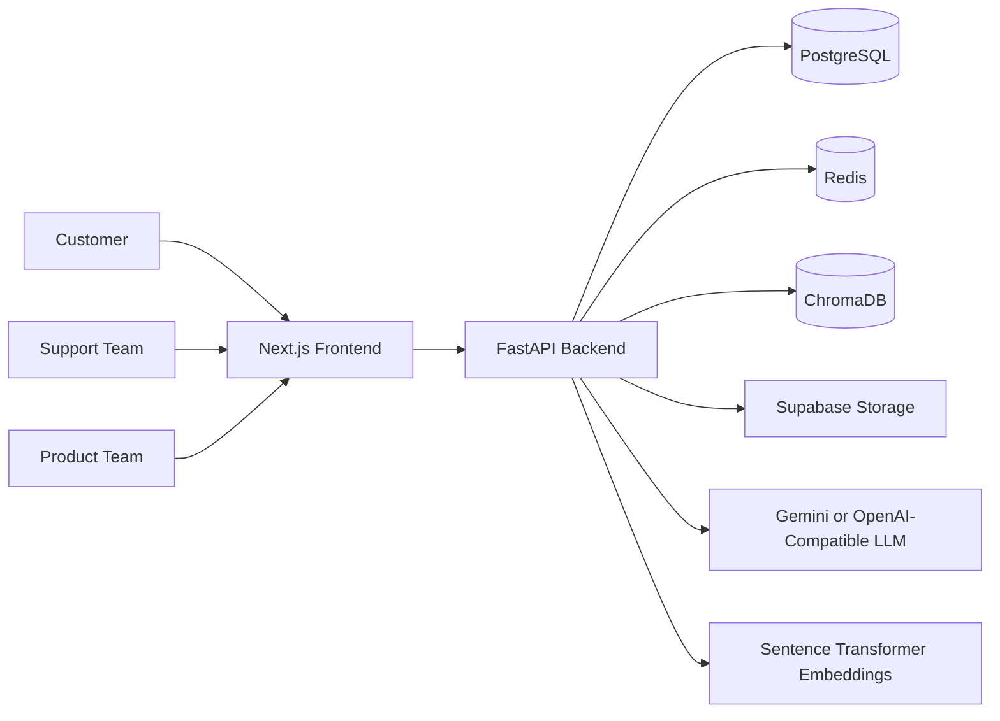
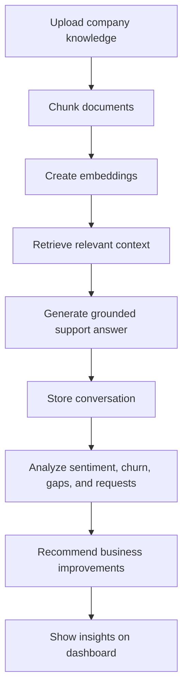
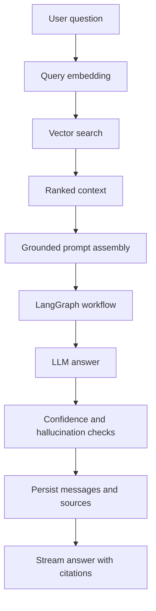

# Architecture

EchoTwin AI is designed as a modular SaaS platform that combines customer support automation with business intelligence.

---

## High-level system

---

## Core product loop

---

## RAG workflow

---

## Key architectural choices

- **Monorepo**: fast hackathon delivery with clear boundaries
- **FastAPI**: typed, documented APIs and async support
- **PostgreSQL**: relational business state
- **ChromaDB**: vector search for knowledge chunks
- **Redis**: caching, rate limiting, and coordination
- **LangGraph**: orchestrates specialized agents
- **Supabase Storage**: keeps original knowledge files out of the database

---

## Production concerns

- Secrets via environment variables
- Server-side RBAC enforcement
- Uploaded document validation
- Citations and confidence metadata on AI answers
- Audit logs for sensitive operations
- Background jobs for ingestion and analytics

