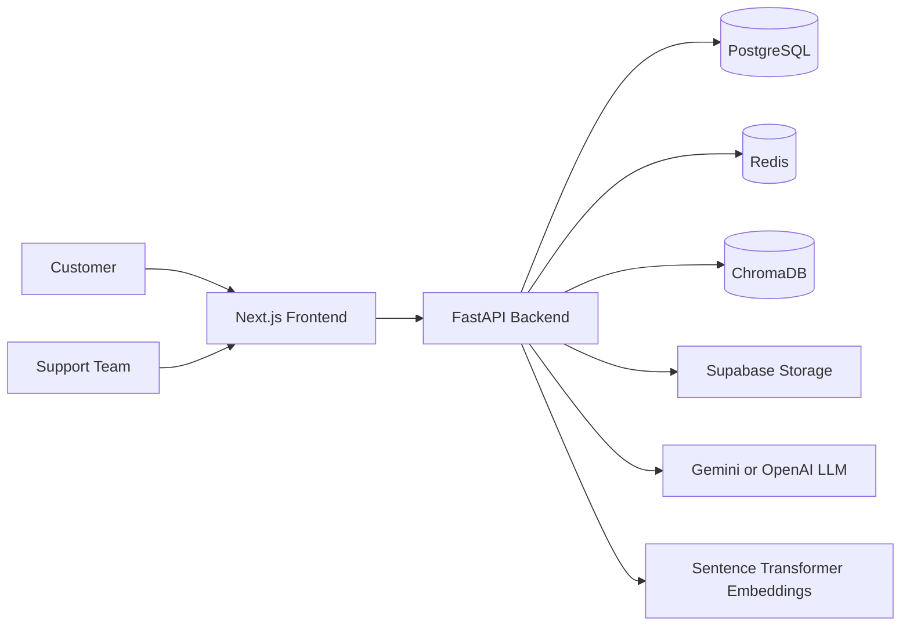
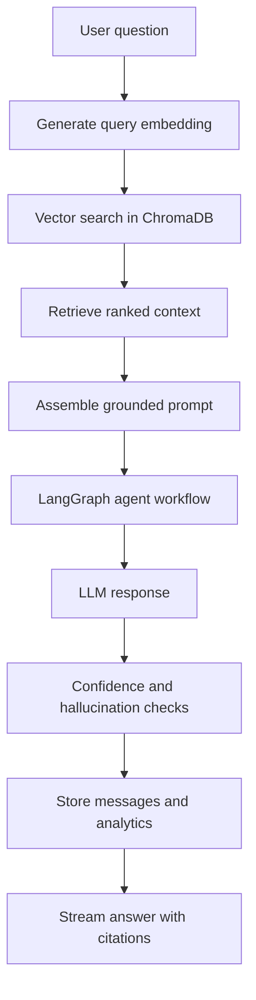

# EchoTwin AI Architecture

## Architectural Principles

EchoTwin AI uses a modular monorepo with clear boundaries between presentation, application, domain, infrastructure, and AI orchestration. The goal is to support a hackathon-speed MVP without creating throwaway code.

## System Context

## Core Modules

- Authentication and identity: JWT, Google OAuth, sessions, RBAC, audit logs
- Knowledge base: upload, parse, chunk, embed, retrieve, delete, and re-index
- AI chat: RAG, citations, memory, confidence scoring, feedback, and streaming
- Agents: support, sales, sentiment, analytics, knowledge, and recommendations
- Insights: recurring complaints, churn risk, missing docs, pain points, feature requests
- Analytics: KPIs, trends, agent performance, satisfaction, confidence, and recommendations

## AI Workflow

## Data Ownership

PostgreSQL stores relational business state, ChromaDB stores vector-searchable chunks, Redis handles cache and rate limiting, and Supabase Storage stores uploaded source files.

