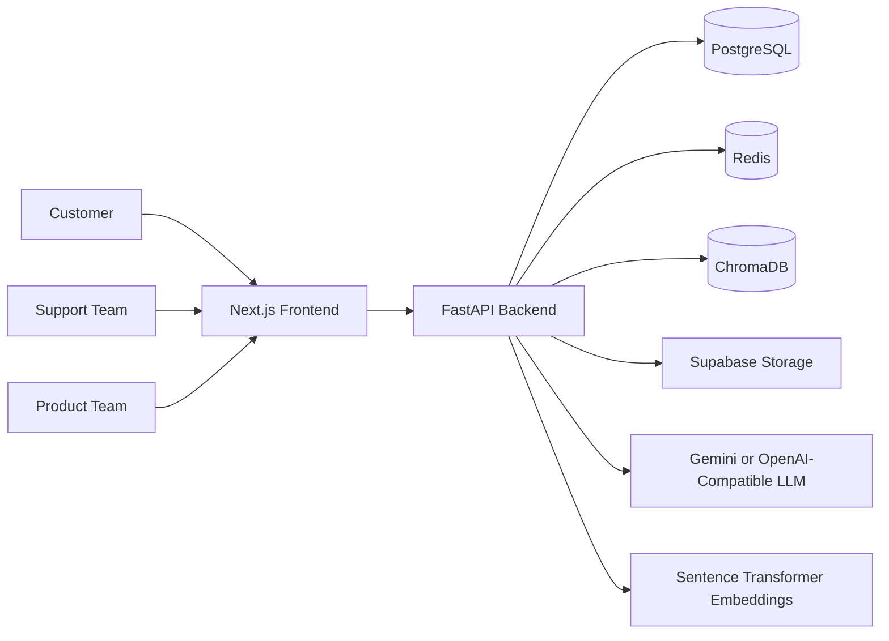
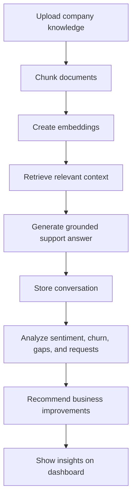
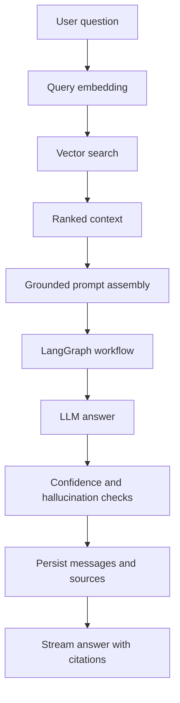

# Architecture

EchoTwin AI is designed as a modular SaaS platform that combines customer support automation with business intelligence. The architecture prioritizes judge-friendly clarity, MVP feasibility, and a credible path to production.

## High-Level System

## Core Product Loop

## RAG Workflow

## Multi-Agent Plan

| Agent | Responsibility |
| --- | --- |
| Support Agent | Answer customer questions using retrieved knowledge |
| Knowledge Agent | Evaluate retrieved context and documentation quality |
| Sentiment Agent | Classify emotion, urgency, and satisfaction |
| Analytics Agent | Aggregate trends and recurring issues |
| Recommendation Agent | Suggest documentation and product improvements |
| Sales Agent | Detect upsell and expansion opportunities |

## Architectural Decisions

- Monorepo keeps hackathon delivery fast while preserving clear boundaries.
- FastAPI provides typed, documented backend APIs and async support.
- PostgreSQL stores relational business data.
- ChromaDB stores vector-searchable document chunks.
- Redis supports caching, rate limiting, and future background coordination.
- LangGraph coordinates specialized AI agents instead of one oversized prompt.
- Supabase Storage keeps original knowledge files out of the application database.

## Production Concerns

- Secrets live in environment variables, never source control.
- RBAC is enforced server-side.
- Uploaded documents are scanned and type-validated.
- AI answers include citations and confidence metadata.
- Audit logs track sensitive actions.
- Background jobs handle expensive ingestion and analytics tasks.

