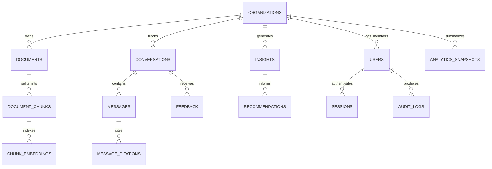

# Entity Relationship Diagram

EchoTwin AI uses a normalized PostgreSQL schema so customer conversations, knowledge-base documents, insights, and recommendations can be queried reliably.

The database implementation begins in Phase 3. This document records the intended model for judges and future contributors.

## Planned Tables

| Table | Purpose |
| --- | --- |
| `organizations` | Tenant/workspace boundary |
| `users` | User profile and role membership |
| `sessions` | Refresh sessions and login tracking |
| `documents` | Uploaded knowledge-base files |
| `document_chunks` | Parsed text chunks with metadata |
| `chunk_embeddings` | Vector metadata and Chroma references |
| `conversations` | Customer or support chat sessions |
| `messages` | User and assistant messages |
| `message_citations` | Source-backed answer references |
| `feedback` | User ratings and answer quality signals |
| `insights` | Complaints, churn risks, gaps, feature requests |
| `recommendations` | AI-generated business actions |
| `analytics_snapshots` | Cached dashboard metrics |
| `audit_logs` | Security and compliance events |

## Schema Priorities

- Strong tenant isolation by organization
- Foreign keys for traceable insights
- Auditability for sensitive operations
- Efficient pagination for conversations and documents
- Metadata columns for AI confidence, source quality, and processing status

