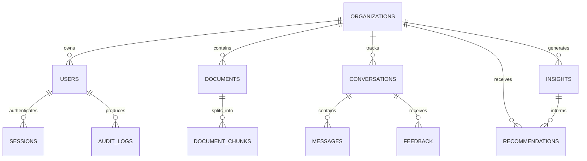

# Entity Relationship Diagram

The database implementation arrives in Phase 3. This model guides the normalized schema.

```mermaid
erDiagram
  ORGANIZATIONS ||--o{ USERS : owns
  ORGANIZATIONS ||--o{ DOCUMENTS : contains
  DOCUMENTS ||--o{ DOCUMENT_CHUNKS : splits_into
  ORGANIZATIONS ||--o{ CONVERSATIONS : tracks
  CONVERSATIONS ||--o{ MESSAGES : contains
  CONVERSATIONS ||--o{ FEEDBACK : receives
  ORGANIZATIONS ||--o{ INSIGHTS : generates
  ORGANIZATIONS ||--o{ RECOMMENDATIONS : receives
  USERS ||--o{ SESSIONS : authenticates
  USERS ||--o{ AUDIT_LOGS : produces
  INSIGHTS ||--o{ RECOMMENDATIONS : informs
```

